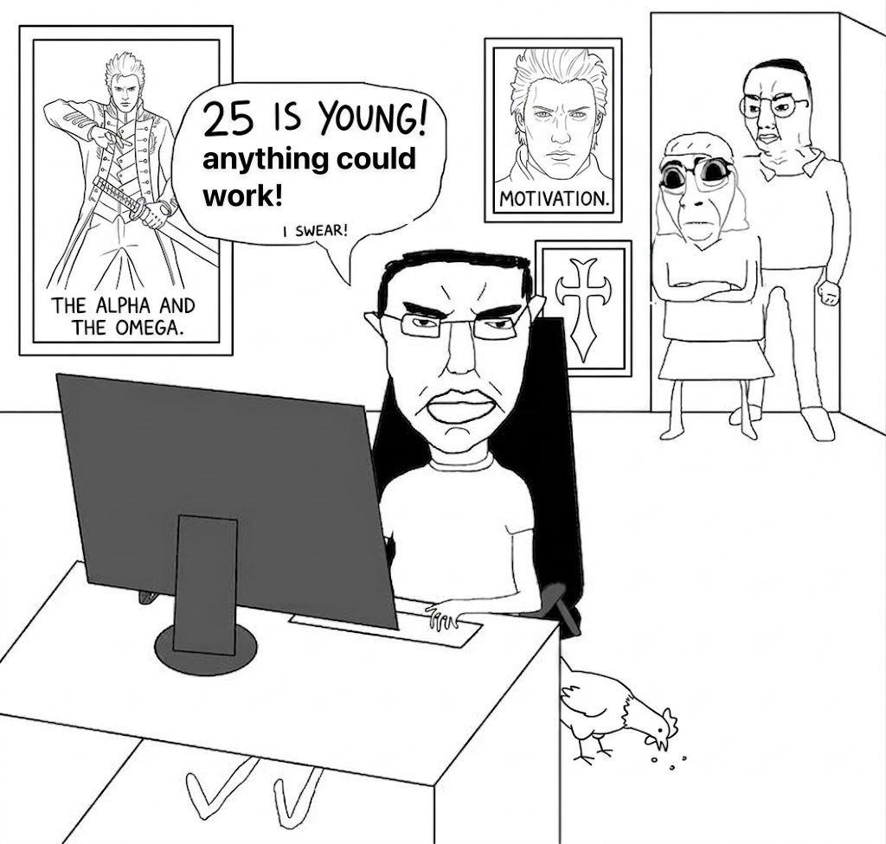

Title: About
Slug: about
Status: published
Summary: an attempt at talking about myself. ML, Rust, research, and "anything could work".

  

  i'm 29 but that's beside the point
  

so in short, i like ML. yeah. i worked on it professionally at [@hud_evals](https://x.com/hud_evals), and before that i was mainly doing sysadmin contracting and SWE odd jobs (i'm pretty goated at data scraping).

currently i'm at a stealth startup doing Rust SWE for agentic workflows and pipelines, frontend and backend included. mainly TS and Rust, but my favorite stack would be ML / Python / research, i guess.

i'm also currently doing stuff at [@primeintellect](https://x.com/PrimeIntellect)'s RL residency, will release more stuff soon

let's see. if you know me on twitter and understood the meme above, you've probably noticed i have a weird obsession with motivation, pragmatism, and optimism. yes, but i usually find these to be reductive, and i have yet to fully map out in word space what i think in those cases. i guess you could call me a [meliorist](https://en.wikipedia.org/wiki/Meliorism).

my favorite catchphrase is **"anything could work"**, and you'll find me echoing this a lot throughout my projects and writing.

i'm usually driven by frustration or interest when it comes to projects. i really loathe impossibility from a technical point of view, and i can almost always find a way around problems.

you can reach me on [Twitter](https://x.com/secemp9), find me on [GitHub](https://github.com/secemp9) and [Hugging Face](https://huggingface.co/secemp9), or send me an [email](mailto:secemp9@gmail.com).

p.s. i have autism and ADHD, and i like the number 9 for some reason.
